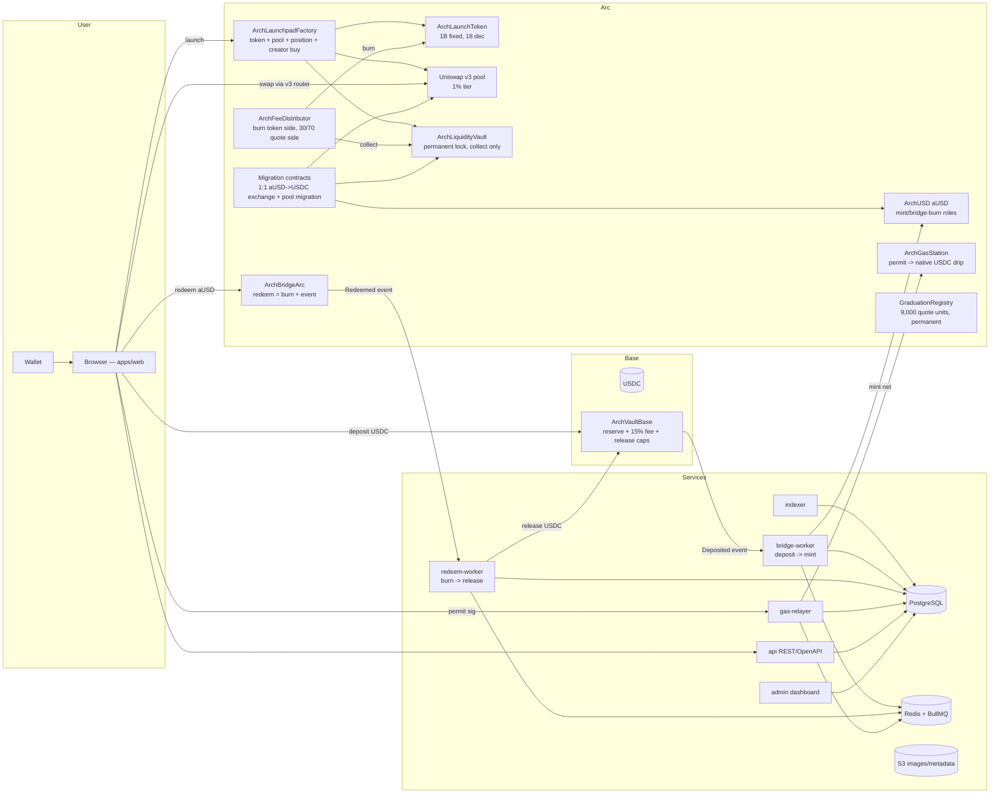

# Arch Architecture

> Bridge USDC to Arc. Launch a token. Trade immediately through permanently locked Uniswap liquidity.

## System diagram

## Money flows

1. **Deposit (Base→Arc)**: user approves + `deposit(amount, arcRecipient)` → 15% fee to bridge treasury, net retained as reserve → `Deposited` event → bridge-worker waits confirmation depth → mints exactly net aUSD on Arc → status API `completed`.
2. **Redeem (Arc→Base)**: `redeem(amount, baseRecipient)` burns aUSD → redeem-worker waits Arc finality policy → keeper calls `release(arcTxHash, logIndex, recipient, amount)` (on-chain replay-proof) → 1:1 USDC out, no fee.
3. **Gas**: quote (live gas × buffer + relayer cost + visible 5% margin, expiry) → EIP-2612 permit → relayer `drip` → native Arc USDC to user.
4. **Launch**: one tx: mint 1B token → create+initialize v3 pool (~$3,000 mcap, 1% tier, both orderings handled) → single-sided full-supply position → NFT locked in liquidity vault → optional creator buy (`minTokensOut`, `deadline`) → `Launched(token, creator, pairToken, pool, positionId, metadataUri)`. Launch fee: 52.5 quote units (52,500,000 raw), read live from the contract.
5. **Fees**: permissionless `distribute(pool)` (+operator batch): collect from locked position → token-side 100% burned → quote-side 30% immutable creator / 70% protocol treasury → `FeesDistributed`.
6. **Graduation**: registry marks permanently when pool quote balance first reaches 9,000 units; UI-only; indexer independently verifies.
7. **Wind-down**: pause deposits → prove reserve ≥ supply → move reserve → open permanent 1:1 exchange (cannot open underwater) → migrate aUSD pools to USDC preserving price/amounts/recipients → factory `pairToken` updated → indexer marks per-pool state.

## Trust boundaries

- Contracts are the source of truth; workers are replaceable executors; the DB is a cache reconstructible from chain events.
- Keys: minter path (Arc), keeper (Base release), relayer (gas) are separate, capped, hot; treasuries and admin sit behind a timelocked multisig; no treasury keys on app servers.
- Frontend trusts only: contract reads (fees, limits) and the Arch API (statuses, market data). Source receipts never imply completion.

## Repository map

See `README.md` for the app/package layout; `docs/adr/` for decisions; `docs/security/threat-model.md` for the control matrix; `docs/research/envelope-parity-report.md` for parity statuses.
